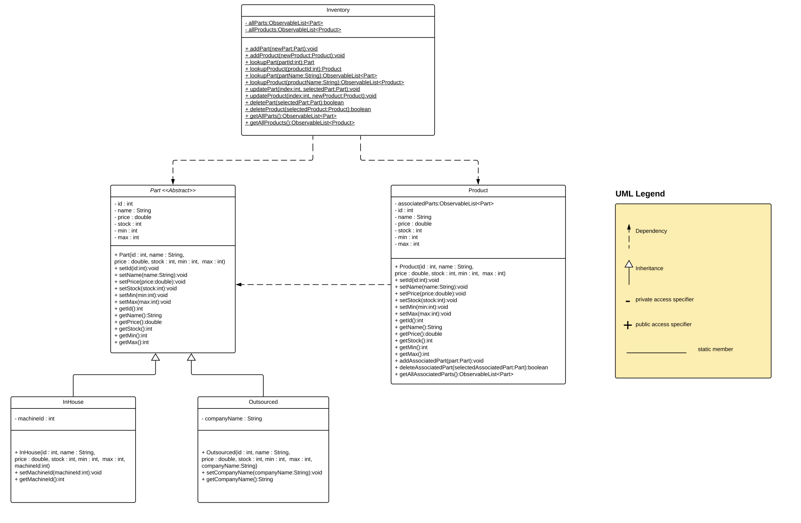
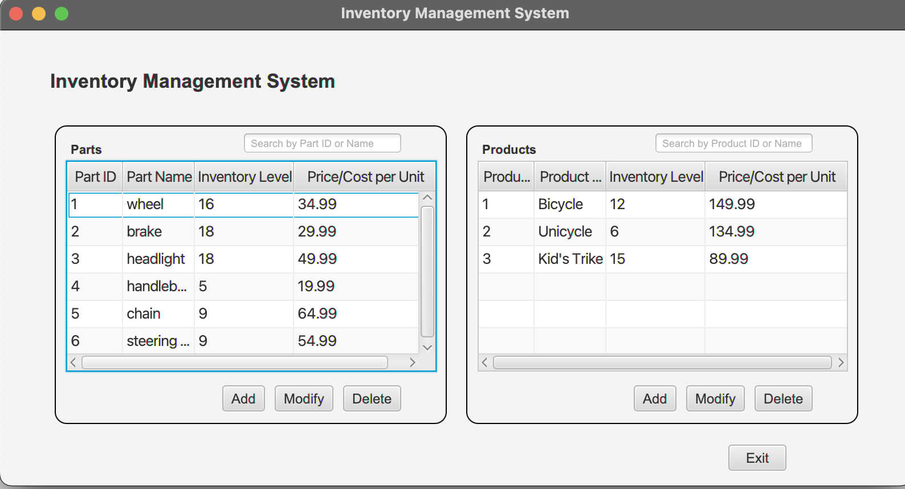
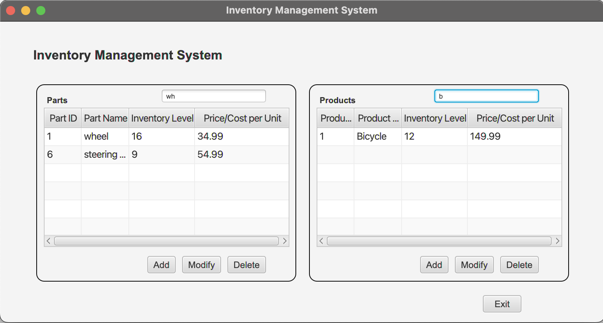
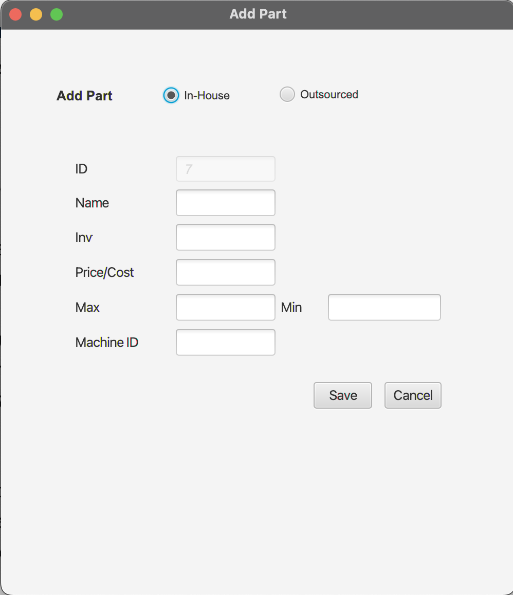
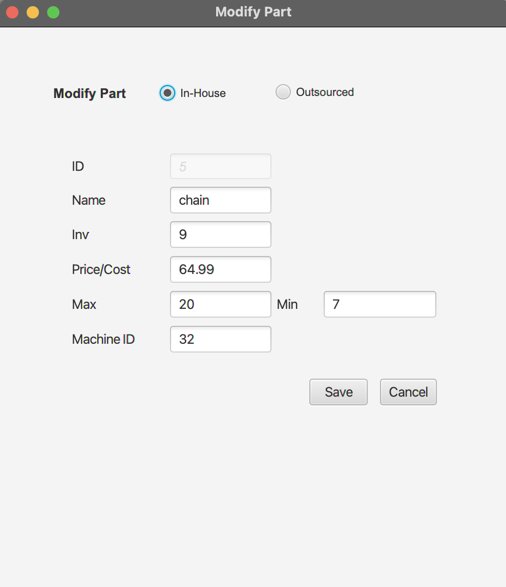
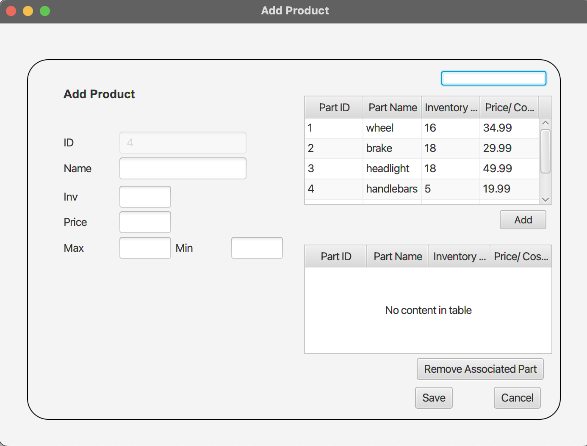
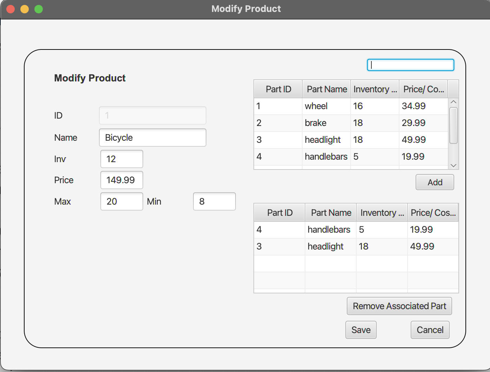

### Inventory Management System created with JavaFX

 
CRUD Application implemented with Java, using the JavaFX framework and 
Scene Builder to create the Graphical User Interface. The program follows the
Model-View-Controller architectural pattern.

The UML diagram below show the classes shows the models used, and their 
respective attributes and methods.

The MainWindow controller directs the user to the scene controlled by the AddPart, ModifyPart, AddProduct, and ModifyProduct controllers.

All "destructive" actions (exiting, deleting, removing) on any screen prompt the user for confirmation. Exceptions caused by invalid user input and other unexpected user actions are caught.

You can search for products and parts based on name and/or id # via 
the search bar. See the filtered screen below.

The Add Part scene. Part is an abstract class, so every item must be of the In-House or Outsourced subclass.

The Modify Part scene. When a part is selected from the main window and the modify button is clicked, the fields are automatically populated with the part's data upon intialization.

The Add Product scene. Parts may be added from the top table to the bottom table. The Remove Associated Part button will remove an added part on user confirmation.

The Modify Product. Automatically populates with data and allows user to modify an existing product.

